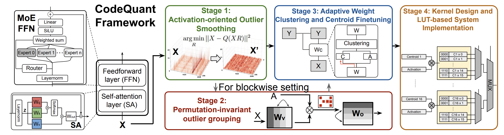

# CodeQuant: Unified Clustering and Quantization for Enhanced Outlier Smoothing in Low-Precision Mixture-of-Experts
<p>
    <a href="https://openreview.net/forum?id=ATpchFiBQi">OpenReview</a>
</p>

## 📖Introduction
CodeQuant is a codebook-based quantization framework for efficient low-precision deployment of Mixture-of-Experts (MoE) large language models. It addresses the key challenge of severe activation outliers that degrade accuracy under 4-bit quantization by combining learnable activation smoothing with outlier-aware weight clustering. CodeQuant introduces activation-oriented rotations to relocate activation outliers into the weight space, followed by permutation-invariant weight grouping and adaptive centroid finetuning to minimize clustering error. The quantized model is deployed using a specialized lookup-table (LUT) kernel, enabling fast inference with no runtime overhead. Across multiple MoE models, CodeQuant reduces memory footprint, accelerates inference, and preserves model accuracy under extreme low-bit settings.


## 🔧How to use
### Environment
- DeepSeek-V2-Lite Model:
````shell
pip install -r requirements-deepseek.txt
````
- Other Models:
````shell
pip install -r requirements.txt
````
### Config:
- Add new: model_name.yaml and save under configs/
- Modify:
````yaml
accelerator:
  device: "cuda" 

path: # default saving path
  offline_data_path: "./data/offline" 
  smooth_data_path: "./data/smooth"
  rotation_data_path: "./data/rotation"
  cluster_data_path: "./data/clustering"

model:
  model_name: # huggingface model path

calibration:
  dataset_name: # calibration dataset name (huggingface dataset path)

common_setting:
  weight_group_size: # -1 for embedding-wise setup, number (e.g. 1024) for block-wise setup
  input_group_size: # -1 for embedding-wise setup, number (e.g. 1024) for block-wise setup
  cluster_num: # follow k=2^b where b is the target bitwidth
  activation_quantization_bit: # activation quantization bitwidth

cluster: # ACCF
  permutation: # POG enabled or not
  max_sample: # number of calibration samples to use
  batch_size: # batch size for clustering fine-tune
  max_length: # max sequence length for clustering fine-tune
  epochs: # clustering fine-tune epochs
  fine_tune_lr: # clustering fine-tune learning rate

rotation: # AOS
  max_sample: # number of calibration samples to use for rotation fine-tune
  batch_size: # batch size for rotation fine-tune
  max_length: # max sequence length for rotation fine-tune
  epochs: # rotation fine-tune epochs
  fine_tune_lr: # rotation fine-tune learning rate

eval:
  activation_quantization_bit:  # activation quantization bitwidth
  weight_quantization_bit: # weight quantization bitwidth, only for benchmark evaluation
  tasks: # evaluation tasks, "task1,task2,...,taskN", each task following naming convention of lm-eval
  ppls: # perplexity tasks, "ppl1,ppl2,...,pplN", each task is a huggingface dataset path
````
### Pipeline:
- Step1: run AOS:
````shell
cd script/
python rotation_fine_tune_script.py --config model_name.yaml
````
- Step2: run ACCF:
````shell
# cd script/
python cluster_fine_tune_script.py --config model_name.yaml
````
- Step3: evaluate:
````shell
# cd script/
python evaluation_script.py --config model_name.yaml # fake quantization will be used for evaluation
````

## 📄Citation
will be publised soon.